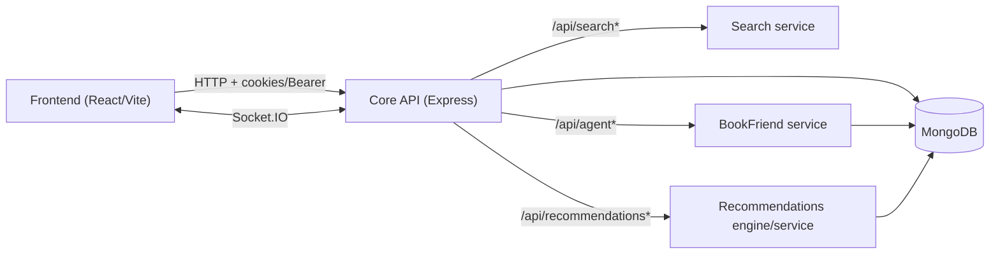

# After The Last Page

After The Last Page (ATLP) is an AI-assisted social reading platform where books are not endpoints—they’re starting points.

ATLP combines:
- a modern reading experience (continue reading, saved position),
- book-centric discussion threads,
- lightweight real-time “meet” rooms (text / voice / video),
- and an agent companion (“BookFriend”) designed for context-aware conversations about what you’re reading.

This repository contains the full-stack app (`atlp-core-api/`) and supporting microservices (`atlp-services/`).

## What makes it different

Most reading apps optimize for consumption and treat social as a comment layer. ATLP is built around interaction:
- **Book identity is first-class.** Threads and meet rooms are anchored to a stable book key (`source:sourceId`), so discussion follows the book across providers.
- **Agent chat is sessioned.** BookFriend uses an explicit lifecycle (start → message → end), enabling better UX and safer cleanup.
- **Microservice boundaries are intentional.** Search, recommendations, and the agent are isolated so they can evolve independently without bloating the core API.

## Product features

- **Your Desk**
  - Continue reading + recent activity
  - Recommendations (genre-driven and/or behavior-driven when available)
- **Library**
  - Curated feed (recommendations-backed) and search
- **Threads**
  - Per-book discussion space
  - Thread search across books
- **Meet**
  - Real-time matchmaking for text / voice / video
  - Fast “open threads instead” routing from meet rooms
- **BookFriend (agent)**
  - Session lifecycle management
  - Optional book-index / RAG mode (when the agent service is configured for it)

## Tech stack

- **Frontend:** React + Vite, React Router, Axios, Lucide
- **Core API:** Node.js + Express, MongoDB, Socket.IO
- **Microservices:** Node.js + Express (search, recommendations engine, agent)
- **Local persistence:** reading progress + shelf state in browser storage

## System architecture

The core API acts as the gateway/orchestrator. Specialized services handle search, recommendations, and agent sessions.



For implementation details, see `ROOT_ARCHITECTURE.md`.

## Screenshots / demo

Add screenshots/gifs here when ready:
- `docs/screenshots/desk.png`
- `docs/screenshots/reading-room.png`
- `docs/screenshots/threads.png`
- `docs/screenshots/bookfriend.png`

## Repository layout

- `atlp-core-api/`
  - `frontend/` — React client
  - `backend/` — Core API (auth, books, threads, meet, proxying)
- `atlp-services/`
  - `bookfriend-service/bookfriend-server/` — BookFriend agent service
  - `search-service/` — search microservice
  - `Recommendations-engine/atlp-recommendations/` — recommendations engine (includes vector/embedding workflows)
- `ROOT_ARCHITECTURE.md` — service topology + request lifecycle
- `CLEANUP_REPORT.md` — maintenance notes (if applicable)

## Getting started (local)

Prerequisites:
- Node.js (LTS recommended)
- MongoDB (local or hosted)

### 1) Install dependencies

```bash
cd atlp-core-api
npm install
```

### 2) Configure environment

- Copy `atlp-core-api/backend/.env.example` → `atlp-core-api/backend/.env`
- Set at minimum `MONGODB_URI`
- (Optional) configure microservice URLs for search / recommendations / agent

### 3) Run core API + web app

```bash
cd atlp-core-api
npm run dev:full
```

This starts:
- the **core API** (from `atlp-core-api/backend/`)
- the **frontend** (Vite dev server)

### 4) Run microservices (optional, recommended)

Each service has a `SERVICE_TESTING_GUIDE.md` with exact commands and health checks:
- `atlp-core-api/backend/SERVICE_TESTING_GUIDE.md`
- `atlp-services/bookfriend-service/bookfriend-server/SERVICE_TESTING_GUIDE.md`
- `atlp-services/search-service/SERVICE_TESTING_GUIDE.md`
- `atlp-services/Recommendations-engine/atlp-recommendations/SERVICE_TESTING_GUIDE.md`

## Configuration notes

The core API can proxy to optional services when enabled via environment variables (see `ROOT_ARCHITECTURE.md` and `atlp-core-api/backend/.env.example`):
- `SEARCH_SERVICE_URL` (for `/api/search`)
- `RECOMMENDATIONS_SERVICE_URL` + `RECOMMENDATIONS_SERVICE_ENABLED` (for `/api/recommendations/*`)
- `BOOKFRIEND_SERVER_URL` (for `/api/agent/*`)

If a service is disabled/unavailable, the app is designed to degrade gracefully where possible.

## API surface (high-level)

The frontend primarily talks to the core API. Common entrypoints include:
- `GET /api/health`
- `GET /api/books` and `GET /api/books/read` (book metadata and reading)
- `GET /api/session/status`, `POST /api/session/start`, `POST /api/session/end`
- `POST /api/meet/join`, `POST /api/meet/leave` (meet rooms/matchmaking)
- `GET /api/threads/*` and `POST /api/books/:bookId/threads` (threads)
- `POST /api/agent/start`, `POST /api/agent/message`, `POST /api/agent/end` (BookFriend)

Exact routes and request shapes are best referenced from the service guides and the codebase.

## Contributing

Contributions are welcome—especially around reliability, UX polish, test coverage, and service boundaries.

Suggested workflow:
1. Open an issue describing the problem or proposal.
2. Keep PRs focused (one feature/fix per PR).
3. Include reproduction steps and screenshots where applicable.

## License

This repository does not currently include a license file. If you plan to accept external contributions or publish publicly, add a `LICENSE` (e.g., MIT/Apache-2.0) and clarify third‑party asset usage.

